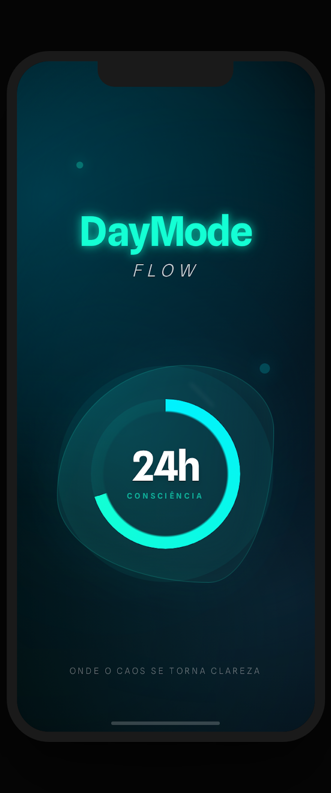
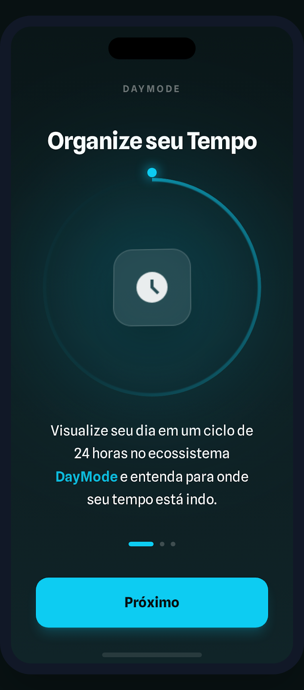
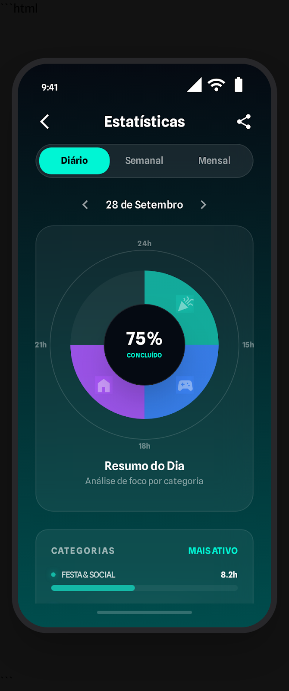
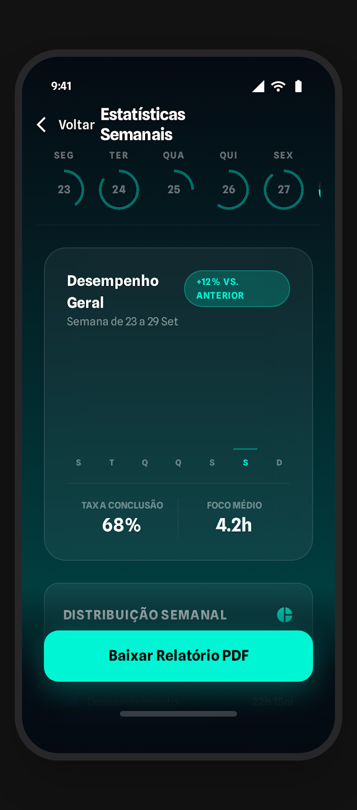
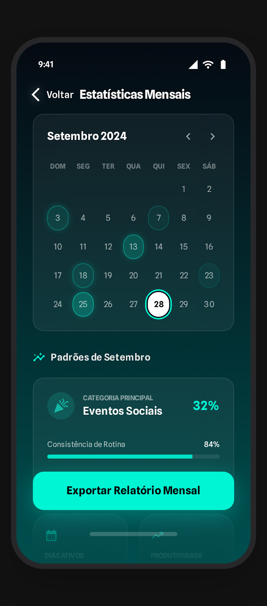
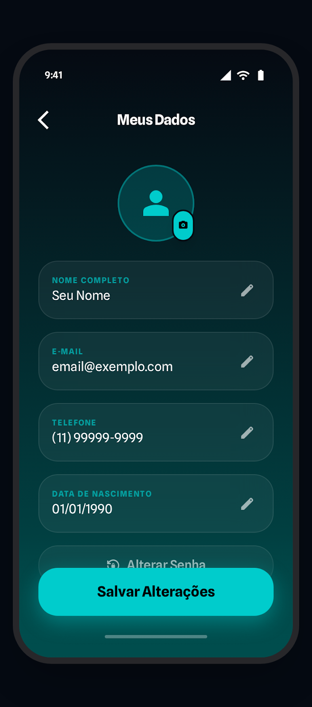

🌙 DayMode | Life OS"Onde o caos se torna clareza."DayMode é um "Life OS" (Sistema Operacional de Vida) projetado para quem busca consciência total sobre o próprio tempo. Diferente de um simples to-do list, o app captura hábitos e constrói tarefas personalizadas, permitindo que o usuário meça exatamente quanto tempo cada atividade consome e como isso impacta sua produtividade profissional e social.🚀 Funcionalidades PrincipaisCiclo de Consciência 24h: Visualize seu dia como um ecossistema completo, entendendo para onde seu tempo está indo em tempo real.Criação Inteligente com IA: Use linguagem natural para criar eventos rapidamente ("Jantar às 20h").Social & Financeiro Integrado: Gestão de eventos sociais com chat de grupo, "vaquinhas" via Pix e checklists colaborativos.Gestão de Serviços e Custos: Controle atividades remuneradas ou domésticas, acompanhando equipes e status de pagamento.Analytics de Alta Performance: Gráficos detalhados de desempenho semanal e consistência mensal gerados com Swift Charts.🎨 Interface & Experience (UI/UX)O app utiliza uma estética Dark Glassmorphism com elementos em neon para reduzir a fadiga visual e manter o foco no que importa.📱 Fluxo de Onboarding e AuthExperiência de entrada imersiva com múltiplos provedores de autenticação (Apple, Google, Instagram e TikTok).Splash ScreenOnboardingLogin SocialPerfil do Usuário🗓️ Gestão e SocialA organização de tarefas encontra a colaboração em tempo real.DashboardCategoriasDetalhes (Serviços)Social (Churrasco)📊 Inteligência de DadosTransformando dados brutos em decisões melhores.Resumo DiárioPerformance SemanalCalendário MensalGestão de Dados🛠️ Especificações TécnicasArquitetura Modular (Feature-First)O projeto foi estruturado para ser escalável e testável, separando responsabilidades de forma clara:Core: Design System (Glassmorphism), extensões e modelos de dados globais.Features: Módulos independentes como Onboarding, Dashboard, Social e Stats.Services: Camada de rede e integrações OAuth.Tech StackLinguagem: Swift 5.10+UI Framework: SwiftUIData Layer: SwiftData (Persistência local)Charts: Swift Charts para visualização de dados complexos.Segurança: Autenticação biométrica e OAuth 2.0.👨‍💻 AutorJoão Paulo SilvaDesenvolvedor iOS focado em arquiteturas modernas e interfaces imersivas.📍 Belém/PALinkedIn | GitHub
