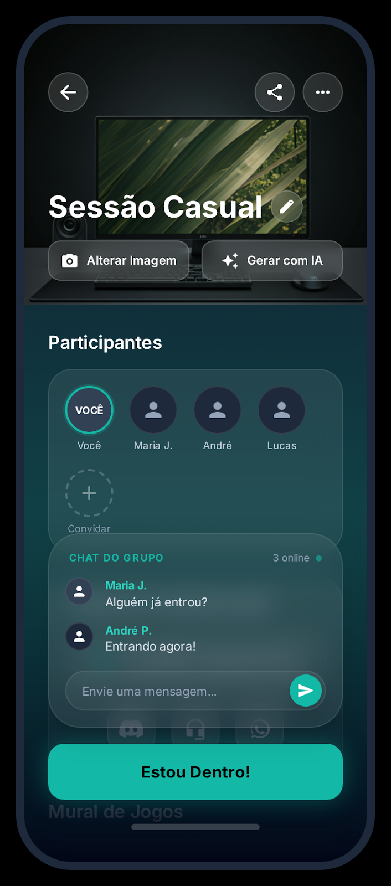

# 🌙 DayMode | Life OS

**DayMode** é um "Life OS" (Sistema Operacional de Vida) focado em organizar seu dia. O objetivo é transformar a gestão de rotina (tarefas, eventos sociais, serviços) em uma experiência visual imersiva, utilizando sincronizações com plagaformas do google e demais e redes sociais medir e ajustar seus objetivos durante o dia e assim estimar sua produtividade nas suas demais metas profissionais e sociais.

---

## 📱 Visual do Projeto

### 🚀 Onboarding & Autenticação
A jornada começa com uma imersão total no ecossistema através de fluxos de login modernos e seguros.

| Splash & Info | Onboarding | Auth Flow | Apple Login |
|:---:|:---:|:---:|:---:|
|  |  |  |  |
| | | | |

### 🗓️ Gestão de Rotina e Eventos Sociais
O coração do app, onde a organização de tarefas encontra a interação social.

| Dashboard | Categorias | Chat de Grupo | Vaquinha & Pix |
|:---:|:---:|:---:|:---:|
|  |  |  |  |
| | | | |

### 📊 Estatísticas & Performance
Análise detalhada de hábitos e produtividade utilizando **Swift Charts**.

| Resumo Diário | Desempenho Semanal | Consistência Mensal |
|:---:|:---:|:---:|
|  |  |  |
| | | |

---

## 🛠️ Especificações Técnicas

### Arquitetura
Este projeto segue uma arquitetura modular baseada em **MVVM** e **Feature-First**:
* **Core:** Modelos de dados e extensões base (Design System).
* **Features:** Módulos independentes (Onboarding, Dashboard, Profile).
* **Shared:** Componentes de UI reutilizáveis (GlassButton, NeonCard).

### Tech Stack
* **Linguagem:** Swift 5+.
* **Interface:** SwiftUI.
* **Banco de Dados:** SwiftData / CoreData (Futuro).
* **Gráficos:** Swift Charts.
* **Integrações:** OAuth (Google, Apple, Instagram, TikTok).

---

## 👨‍💻 Autor
**João Paulo Silva**
* Desenvolvedor iOS focado em SwiftUI e arquiteturas escaláveis.
* Natural de Belém/PA.
* [LinkedIn](https://www.linkedin.com/in/jpdeveloper/) | [GitHub](https://github.com/jplima30)
